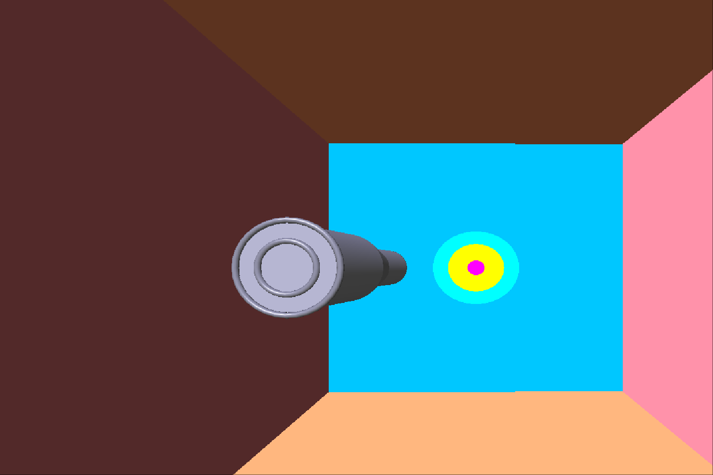
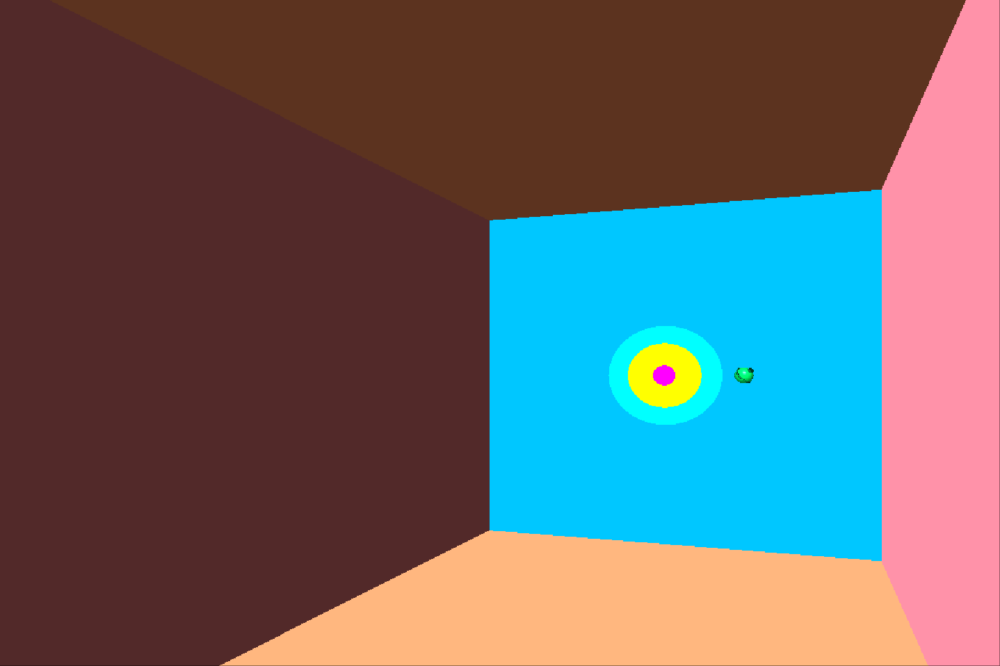

# 🔫 Target - OpenGL 3D Shooting Arena


## 🎯 About the Game

**GunGame** is a fast-paced 3D shooting game developed using **OpenGL**, **GLUT**, and **GLEW** in C++. The player controls a character, aims using the mouse, and shoots bullets to hit moving targets. The game focuses on realistic bullet trajectories, hit detection, scoring logic, and cool transformations using matrix math.

<p align="center">
  
</p>

---

## ⚙️ Features

- 🔥 Bullet firing mechanics with rotation and trajectory control
- 🧠 Target hit detection and scoring system
- 🖱️ Mouse-based aiming and control
- 🌐 Real-time rendering with OpenGL
- 🎯 Wall and boundary collision logic
- 🎮 Easy-to-modify game loop and character system

---

## 🛠️ Build & Run

### 🔧 Dependencies

Make sure you have the following libraries installed:

- `g++`
- `OpenGL` (`libGL`)
- `GLUT` (`freeglut`)
- `GLEW`
- `math` (`libm`)

### 🧱 Build using Makefile

```bash
make
````

Or manually:

```bash
g++ gungame.cpp -o gungame -lGL -lGLU -lglut -lGLEW -lm
```

### ▶️ Run

```bash
./gungame
```

---

## 🎮 Controls

| Action      | Input                                              |
| ----------- | -------------------------------------------------- |
| Aim         | Move Mouse                                         |
| Fire Bullet | Mouse Click or Key Press (depending on your setup) |
| Quit Game   | `Esc` Key                                          |

---

## 📁 Project Structure

```
.
├── gungame.cpp        # Main game logic and rendering
├── Makefile           # Build instructions
├── README.md          # Project documentation
└── assets/            # (Optional) Models, Textures, Sounds
```

---

## ✨ Screenshots

<p float="left">
  
  
</p>

---

## 👨‍💻 Author

**Parth Kapoor**
🔗 [Portfolio](https://parthkapoor.me) • [GitHub](https://github.com/parthkapoor-dev) • [LinkedIn](https://linkedin.com/in/parthkapoor08)

---

## 📜 License

This project is licensed under the MIT License. See the `LICENSE` file for details.

```

---

Let me know if you want to include install instructions for Windows/macOS or expand with levels, sounds, or assets!
```
